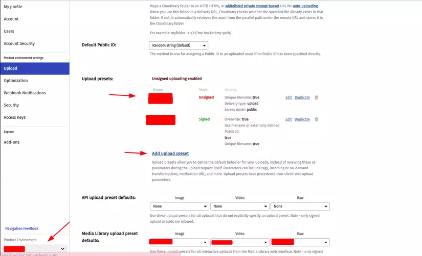
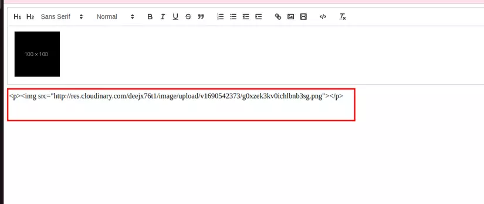

# Hướng dẫn Upload ảnh và video trong React Quill sử dụng Cloudinary
### 1.Giới thiệu:
Trong quá trình phát triển ứng dụng web hoặc trang blog, việc cung cấp một trình soạn thảo phong phú cho người dùng là một nhu cầu phổ biến. Điều này cho phép người dùng tạo, chỉnh sửa và định dạng nội dung của họ một cách linh hoạt và dễ dàng. Một trong những trình soạn thảo phổ biến trong cộng đồng lập trình là React Quill, với khả năng tùy chỉnh cao và dễ tích hợp vào dự án React của bạn.

Tuy nhiên, việc cho phép người dùng tải lên và chèn hình ảnh, video vào trình soạn thảo không phải là điều đơn giản. Đặc biệt khi bạn cần lưu trữ và quản lý hàng ngàn tệp đa phương tiện. Giải pháp là sử dụng dịch vụ lưu trữ hình ảnh đám mây mạnh mẽ như Cloudinary. Cloudinary cho phép bạn lưu trữ, tải lên, và quản lý hình ảnh, video một cách hiệu quả, giúp ứng dụng của bạn tăng cường tính năng và hiệu suất.

Trong bài viết này, chúng ta sẽ tìm hiểu cách tích hợp React Quill với dịch vụ lưu trữ hình ảnh Cloudinary để giải quyết vấn đề phức tạp này. Chúng ta sẽ cùng nhau xây dựng một trình soạn thảo cho phép người dùng tải lên và chèn hình ảnh, video một cách thuận tiện và nhanh chóng.

* React Quill: Là một trình soạn thảo mã nguồn mở cho phép người dùng tạo, chỉnh sửa nội dung với định dạng đa dạng.
* Cloudinary: Dịch vụ lưu trữ đám mây mạnh mẽ hỗ trợ quản lý, tải lên, xử lý hình ảnh và video một cách dễ dàng.
<!-- truncate -->
### 2. Cài đặt react-quill
* Đầu tiên chúng ta cần khởi tạo project react bằng vite hoặc create-react-app
```
yarn create vite react-quill-upload --template react-ts
```
* Cài đặt react-quill :
```
yarn add react-quill
```
* Import react-quill component:
```
import React, { useState } from 'react';
import ReactQuill from 'react-quill';
import 'react-quill/dist/quill.snow.css';

function MyComponent() {
  const [value, setValue] = useState('');
  const reactQuillRef = useRef<ReactQuill>(null);

  return <ReactQuill ref={reactQuillRef} theme="snow" value={value} onChange={setValue} />;
}
```
* Để upload image trong quill editor, chúng ta cần khai báo image vào phần module và formats
```
<ReactQuill
      ref={reactQuillRef}
      theme="snow"
      placeholder="Start writing..."
      modules={{
        toolbar: {
          container: [
            [{ header: "1" }, { header: "2" }, { font: [] }],
            [{ size: [] }],
            ["bold", "italic", "underline", "strike", "blockquote"],
            [
              { list: "ordered" },
              { list: "bullet" },
              { indent: "-1" },
              { indent: "+1" },
            ],
            ["link", "image", "video"],
            ["code-block"],
            ["clean"],
          ],
        },
        clipboard: {
          matchVisual: false,
        },
      }}
      formats={[
        "header",
        "font",
        "size",
        "bold",
        "italic",
        "underline",
        "strike",
        "blockquote",
        "list",
        "bullet",
        "indent",
        "link",
        "image",
        "video",
        "code-block",
      ]}
      value={value}
      onChange={onChange}
    />
```
* Lúc này bạn sẽ thấy icon upload image trên thanh công cụ của react-quill. Hãy import thử và in giá trị của toàn bộ văn bản ra, bạn sẽ thấy rằng mặc định react-quill sẽ lưu ảnh của bạn dưới dạng base-64:


> => nếu sử dụng theo cách mặc định này, chúng ta hoàn toàn có thể lưu trữ ảnh trong database dưới dạng base 64, trong demo mình chỉ sử dụng ảnh với kích thước nhỏ, nếu ảnh càng lớn string base-64 sẽ càng lớn, như thế sẽ rất tốn bộ nhớ.

### 3. Handle upload image
* Để đỡ phải lưu chữ hình ảnh trong đoạn văn bản dưới dạng base-64, chúng ta cần tích hợp một clould service và chỉ cần lưu lại đường link của ảnh đó.Tiếp theo đây mình sẽ hướng dẫn các bạn handle hành động upload của react-quill và sử dụng cloudinary để lưu trữ nó ( các bạn có thể làm tương tự với một cloud bất kỳ nào khác, ví dụ firebase storage, ... )
* Thêm imageHandler
```
 <ReactQuill
      ref={reactQuillRef}
      theme="snow"
      placeholder="Start writing..."
      modules={{
        toolbar: {
          container: [
             ...
            ["link", "image", "video"],
            ["code-block"],
            ["clean"],
          ],
          handlers: {
            image: imageHandler,   // <- 
          },
        },
        clipboard: {
          matchVisual: false,
        },
      }}
      ...
    />
```

```
  const imageHandler = useCallback(() => {
    const input = document.createElement("input");
    input.setAttribute("type", "file");
    input.setAttribute("accept", "image/*");
    input.click();
    input.onchange = async () => {
      if (input !== null && input.files !== null) {
        const file = input.files[0];
        console.log(file)
      }
    };
  }, []);
```
> Giải thích : Ở đoạn code bên trên, mình viết thêm một hàm để handle container image của react-quill. Trong function imageHandler mình tạo ra một thẻ input file và gọi hàng click() để mở ra cửa sổ import file. Các bạn hoàn toàn có thể mở rộng phần này để mở lên upload widget của cloudinary ( [đọc thêm](https://cloudinary.com/documentation/react_image_and_video_upload) ). **Upload với widget sẽ bảo mật và tối ưu hơn do chúng ta có thể tái sử dụng những ảnh đã upload trước đó, nếu có thời gian và cần thiết, các bạn nên dùng cách đó !**
* Function upload image lên cloudinary:
Có nhiều cách upload lên cloudinary, nhưng mình chọn cách dùng cách gọi api vì nó đơn giản nhất:
```
const uploadToCloudinary = async (file: File): Promise<string> => {
  const formData = new FormData();
  formData.append("file", file);
  formData.append(
    "upload_preset",
    import.meta.env.VITE_CLOUDINARY_PRESET
  );
  const res = await fetch(
    `https://api.cloudinary.com/v1_1/${
      import.meta.env.VITE_CLOUDINARY_NAME
    }/upload`,
    { method: "POST", body: formData }
  );
  const data = await res.json();
  const url = data.url;

  return url
}
```
> Giải thích: để upload ảnh lên cloudinary bằng api, các bạn cần có Product Name và upload_preset, các bạn có thể lấy từ trang setting của cloudinary ( bạn cần để mode của upload_preset là Unsigned, nếu muốn cách bảo mật hơn các bạn có thể dùng các cách upload khác của cloudinary )

* Insert image url trả về từ cloudinary vào nội dung của đoạn văn bản
```
  const imageHandler = useCallback(() => {
    const input = document.createElement("input");
    input.setAttribute("type", "file");
    input.setAttribute("accept", "image/*");
    input.click();
    input.onchange = async () => {
      if (input !== null && input.files !== null) {
        const file = input.files[0];
        const url = await uploadToCloudinary(file);
        const quill = reactQuillRef.current;
        if (quill) {
          const range = quill.getEditorSelection();
          range && quill.getEditor().insertEmbed(range.index, "image", url);
        }
      }
    };
  }, []);
```
> Giải thích: Sau khi có được url từ việc upload lên cloudinary, chúng ta cần gán nó vào đúng vị trí của thẻ img tương ứng trong đoạn văn bản:
 ```
const range = quill.getEditorSelection();
 range && quill.getEditor().insertEmbed(range.index, "image", url);
```
> Phần này chính là để xác định vị trí của thẻ img và gán nó với url trả về từ cloudinary ( trước đó hãy dùng useRef để tham chiếu đến ReactQuill component )

* Và đây là kết quả, lúc này nội dung văn bản chỉ còn chứa đường link của ảnh thay vì base-64:


Toàn bộ source code có thể xem ở: https://github.com/phamquyetthang/react-quill-image-upload


### 4. Kết luận
Trên đây là hướng dẫn đơn giản của mình để handle việc upload hình ảnh trong react-quill, các bạn có thể làm điều tương tự với việc upload video!

Các bạn có thể xem toàn bộ code của phần hướng dẫn trên trong github của mình: https://github.com/phamquyetthang/react-quill-image-upload

Hy vọng bài viết này hữu ích với bạn. Cảm ơn bạn đã đọc!

Nếu có bất kỳ câu hỏi hoặc ý kiến gì, hãy để lại bình luận bên dưới. Chúng ta có thể cùng nhau thảo luận về chủ đề này.