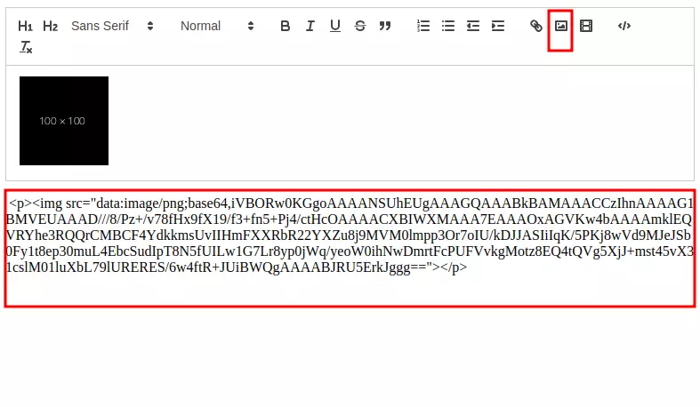
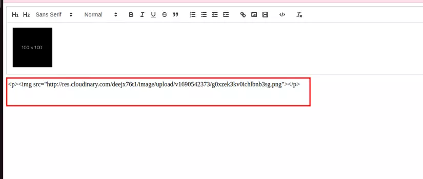

# Uploading Images and Videos in React Quill using Cloudinary
### 1.Introduction:
In the process of developing web applications or blogs, providing a rich text editor for users is a common requirement. This allows users to create, edit, and format their content flexibly and easily. One popular text editor in the programming community is React Quill, known for its high customization and easy integration into your React projects.

However, allowing users to upload and insert images or videos into the text editor is not a simple task. Especially when you need to store and manage thousands of multimedia files. The solution is to use a powerful cloud image storage service like Cloudinary. Cloudinary allows you to store, upload, and manage images and videos efficiently, enhancing the functionality and performance of your application.

In this article, we will learn how to integrate React Quill with the Cloudinary image storage service to address this complex issue. Together, we will build an editor that enables users to conveniently and quickly upload and insert images and videos.

* React Quill: An open-source text editor that allows users to create and edit content with various formats.
* Cloudinary: A powerful cloud storage service that supports easy management, uploading, and processing of images and videos.
<!-- truncate -->
### 2. Installing react-quill
* First, we need to initialize a React project using Vite or create-react-app.
```
yarn create vite react-quill-upload --template react-ts
```
* Install react-quill:
```
yarn add react-quill
```
* Import react-quill component:
```
import React, { useState } from 'react';
import ReactQuill from 'react-quill';
import 'react-quill/dist/quill.snow.css';

function MyComponent() {
  const [value, setValue] = useState('');
  const reactQuillRef = useRef<ReactQuill>(null);

  return <ReactQuill ref={reactQuillRef} theme="snow" value={value} onChange={setValue} />;
}
```
* To upload images in the quill editor, declare the image in the modules and formats section.
```
<ReactQuill
      ref={reactQuillRef}
      theme="snow"
      placeholder="Start writing..."
      modules={{
        toolbar: {
          container: [
            [{ header: "1" }, { header: "2" }, { font: [] }],
            [{ size: [] }],
            ["bold", "italic", "underline", "strike", "blockquote"],
            [
              { list: "ordered" },
              { list: "bullet" },
              { indent: "-1" },
              { indent: "+1" },
            ],
            ["link", "image", "video"],
            ["code-block"],
            ["clean"],
          ],
        },
        clipboard: {
          matchVisual: false,
        },
      }}
      formats={[
        "header",
        "font",
        "size",
        "bold",
        "italic",
        "underline",
        "strike",
        "blockquote",
        "list",
        "bullet",
        "indent",
        "link",
        "image",
        "video",
        "code-block",
      ]}
      value={value}
      onChange={onChange}
    />
```
* Now you will see the upload image icon on the toolbar of react-quill. Import and print the entire text content, and you will see that by default, react-quill saves your image as base-64:


> => If using this default approach, we can store the image in the database as base-64. In the demo, I only use small-sized images. If the image size is larger, the base-64 string will be larger, consuming more memory.

### 3. Handle upload image
* To avoid storing images in the text content as base-64, we need to integrate a cloud service and only store the image's link. Next, I will guide you on handling the upload action of react-quill and using Cloudinary to store it (you can do the same with any other cloud, e.g., Firebase Storage, ...).
* Add the imageHandler
```
 <ReactQuill
      ref={reactQuillRef}
      theme="snow"
      placeholder="Start writing..."
      modules={{
        toolbar: {
          container: [
             ...
            ["link", "image", "video"],
            ["code-block"],
            ["clean"],
          ],
          handlers: {
            image: imageHandler,   // <- 
          },
        },
        clipboard: {
          matchVisual: false,
        },
      }}
      ...
    />
```

```
  const imageHandler = useCallback(() => {
    const input = document.createElement("input");
    input.setAttribute("type", "file");
    input.setAttribute("accept", "image/*");
    input.click();
    input.onchange = async () => {
      if (input !== null && input.files !== null) {
        const file = input.files[0];
        console.log(file)
      }
    };
  }, []);
```
> Explanation: In the code above, I added a function to handle the image container of react-quill. In the imageHandler function, I create an input file element and trigger a click() to open the file import window. You can extend this part to open the cloudinary upload widget ( [read more](https://cloudinary.com/documentation/react_image_and_video_upload) ). **Using the widget is more secure and efficient because we can reuse previously uploaded images. If you have time and need, you should use that method!**
* Function to upload the image to Cloudinary:
There are many ways to upload to Cloudinary, but I choose the simplest method of calling the API:
```
const uploadToCloudinary = async (file: File): Promise<string> => {
  const formData = new FormData();
  formData.append("file", file);
  formData.append(
    "upload_preset",
    import.meta.env.VITE_CLOUDINARY_PRESET
  );
  const res = await fetch(
    `https://api.cloudinary.com/v1_1/${
      import.meta.env.VITE_CLOUDINARY_NAME
    }/upload`,
    { method: "POST", body: formData }
  );
  const data = await res.json();
  const url = data.url;

  return url
}
```
> Explanation: To upload an image to Cloudinary via the API, you need the Product Name and upload_preset, which you can obtain from the cloudinary settings page (set the upload_preset mode to Unsigned for simplicity; for enhanced security, you can use other cloudinary upload methods).

* Insert the image URL returned from Cloudinary into the text content.
```
  const imageHandler = useCallback(() => {
    const input = document.createElement("input");
    input.setAttribute("type", "file");
    input.setAttribute("accept", "image/*");
    input.click();
    input.onchange = async () => {
      if (input !== null && input.files !== null) {
        const file = input.files[0];
        const url = await uploadToCloudinary(file);
        const quill = reactQuillRef.current;
        if (quill) {
          const range = quill.getEditorSelection();
          range && quill.getEditor().insertEmbed(range.index, "image", url);
        }
      }
    };
  }, []);
```
> Explanation: After obtaining the URL from uploading to Cloudinary, we need to assign it to the correct position of the corresponding img tag in the text content:
 ```
const range = quill.getEditorSelection();
 range && quill.getEditor().insertEmbed(range.index, "image", url);
```
> This part is to determine the position of the img tag and assign it with the URL returned from Cloudinary (before this, use useRef to reference the ReactQuill component).

* And here is the result, now the text content only contains the link of the image instead of base-64:


You can find the entire source code at: https://github.com/phamquyetthang/react-quill-image-upload


### 4. Conclusion
This is my simple guide on handling image uploads in react-quill; you can do something similar with video uploads!

You can view the entire code of this tutorial on my GitHub: https://github.com/phamquyetthang/react-quill-image-upload

I hope this article is helpful to you. Thank you for reading!

If you have any questions or comments, please leave them below.
