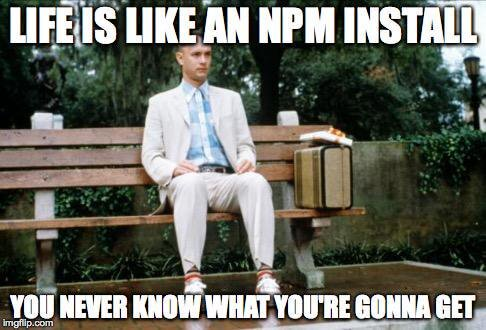
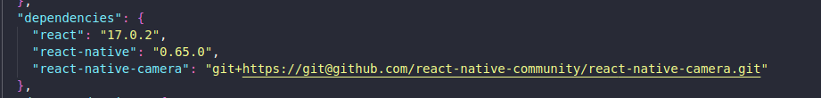
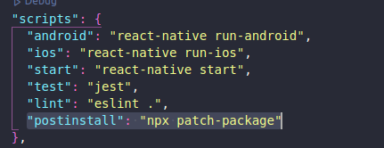
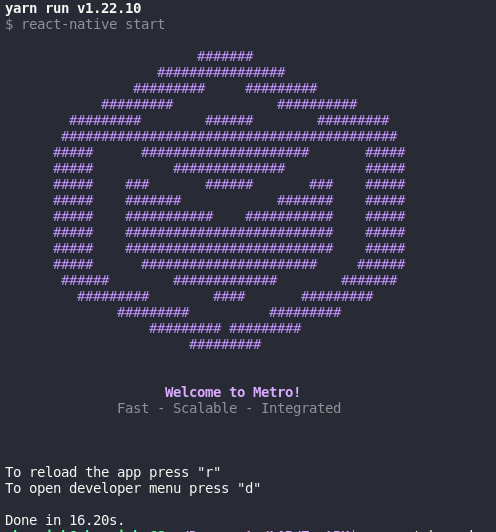
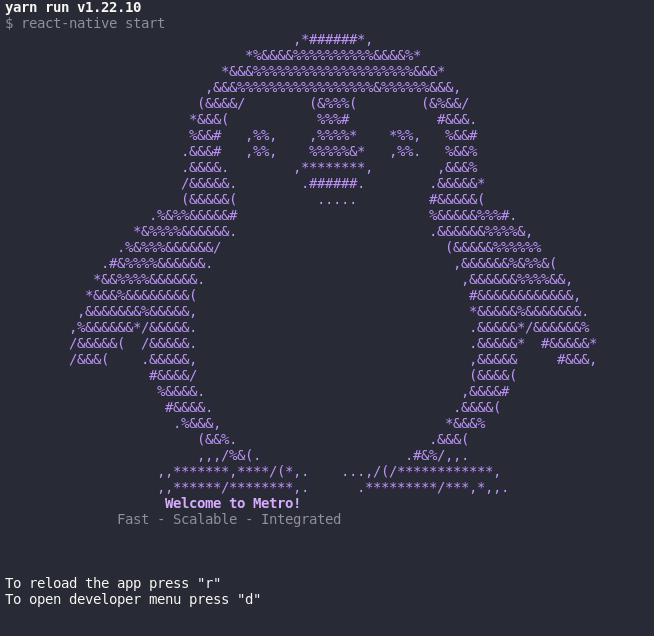

Ways to Fix Errors in node_modules and Preserve Edits (Using patch-package, ...)
## 1. When Fixing a Library from npm:
For JavaScript enthusiasts, installing third-party libraries using the command `npm install <package name>` (or yarn) is a familiar routine.

After installation, these libraries reside in the node_modules directory, and we can easily use them.

What's inside the node_module is usually not something we need to know in detail. The node_module can sometimes be an untouchable area.

Deleting the node_module and reinstalling is a spiritual solution many have used in desperation to fix bugs.

Issues arise when we encounter a problem with a library but don't want to find an alternative.

<!-- truncate -->
### So, how can we fix libraries ourselves without losing changes if we delete the node_module?

Here are some approaches:

## 2. Ways to Fix Libraries in node_modules
### Approach 1: Fork the Package's Repo
You can go to the source code of the package, fork it to your own Git repository, make changes, and then edit it.

Afterward, declare it in your package.json like this:
For example:

Replace the package version with the path to your repository in the format `git+{repo}`.

You may encounter some issues if you try to modify mega-packages like those from Facebook. Some packages are subdirectories of others.

You can go to https://gitpkg.vercel.app/, paste the link directly to the directory containing that package. The website will render a link and yarn (npm) command for you.

(That's the theory, but whether it runs or not... To be sure, you can try approach 2.)

### Approach 2: Use patch-package
This approach is more direct than the first one.

Boldly find the code in your node_module that you want to edit and bravely make the changes.

Then run the command:

`npx patch-package <package name>`

patch-package will create a patches folder, declaring your changes.

You can push this folder to Git and run the `npx patch-package` command to reapply your changes.

To avoid one step each time you reinstall the project, you can add the line `"postinstall": "npx patch-package"` to the scripts like this to let node_module automatically render your changes every time you reinstall.

## 3. Demo:
I have a small demo.

It involves changing the default logo of the metro in REACT-NATIVE.

After some investigation, I found out it was written in a file named TerminalReporter.js in /node_modules/metro/src/lib.

I thought there would be some complicated algorithms to print it out, like the C++ days at school, but no, it's just an array containing each line of #### :)))))

So, I just changed it.

From:

To:

(I did it during the deadline days, too busy, so I decided to spend a day messing around to relieve stress after finishing.)
